<div align="center">



<br>

[](https://www.offsec.com/)
[](https://www.alteredsecurity.com/)
[](https://security.ine.com/)
[](https://omareldemery.com)

</div>

---

```console
$ cat /etc/profile.d/omar.sh
```

```yaml
handle:      amooryx
role:        Offensive Security Engineer · Penetration Tester
focus:       [ web appsec, active directory, cloud, memory forensics ]
certs:       [ OSCP+, CRTP, eWPTX ]
research:    MCP server attack surface · masqueraded process detection
disclosure:  coordinated · authorised engagements only
```

I break things on purpose, with permission, and then write the tool that finds it faster next time. Most of what is below started as something I needed mid-engagement at 2am.

---

## `~/arsenal`

<details open>
<summary><b>Recon &amp; OSINT</b></summary>
<br>

| Tool | What it does |
|---|---|
| [**ReconPal**](https://github.com/amooryx/ReconPal) | Friendly recon + config audit, with MCP deployment discovery |
| [subdomain-storm](https://github.com/amooryx/subdomain-storm) | Subdomain enumeration at speed |
| [cert-recon](https://github.com/amooryx/cert-recon) | Certificate transparency mining |
| [asn-mapper](https://github.com/amooryx/asn-mapper) | ASN → netblock → host mapping |
| [dns-recon](https://github.com/amooryx/dns-recon) · [vhost-scanner](https://github.com/amooryx/vhost-scanner) | DNS and virtual host discovery |
| [git-recon](https://github.com/amooryx/git-recon) · [meta-extract](https://github.com/amooryx/meta-extract) | Exposed VCS and document metadata |
| [param-mine](https://github.com/amooryx/param-mine) | Hidden parameter discovery |
| [email-harvest](https://github.com/amooryx/email-harvest) · [linkedin-recon](https://github.com/amooryx/linkedin-recon) | People and surface OSINT |
| [stealth-scan](https://github.com/amooryx/stealth-scan) · [snmp-walker](https://github.com/amooryx/snmp-walker) | Low-noise port scanning and SNMP enumeration |
| [vpn-probe](https://github.com/amooryx/vpn-probe) | VPN endpoint fingerprinting |

</details>

<details>
<summary><b>Web Application Security</b></summary>
<br>

| Tool | What it does |
|---|---|
| [jwt-attack-suite](https://github.com/amooryx/jwt-attack-suite) | `alg:none`, key confusion, weak HMAC, `kid` injection |
| [oauth-auditor](https://github.com/amooryx/oauth-auditor) | OAuth / OIDC flow weaknesses |
| [ssrf-scanner](https://github.com/amooryx/ssrf-scanner) | SSRF with IMDS and out-of-band testing |
| [ssti-hunter](https://github.com/amooryx/ssti-hunter) · [xxe-injector](https://github.com/amooryx/xxe-injector) | Template and XML injection |
| [smuggler](https://github.com/amooryx/smuggler) · [cache-probe](https://github.com/amooryx/cache-probe) | Request smuggling and cache poisoning |
| [proto-pollute](https://github.com/amooryx/proto-pollute) | Prototype pollution |
| [graphql-attack-mapper](https://github.com/amooryx/graphql-attack-mapper) | GraphQL introspection and resolver abuse |
| [path-traversal](https://github.com/amooryx/path-traversal) · [open-redirect-scanner](https://github.com/amooryx/open-redirect-scanner) | Traversal and redirect chains |
| [waf-bypass](https://github.com/amooryx/waf-bypass) · [host-injector](https://github.com/amooryx/host-injector) | Filter evasion and Host header abuse |
| [api-fuzz](https://github.com/amooryx/api-fuzz) · [cors-tester](https://github.com/amooryx/cors-tester) · [secret-scanner](https://github.com/amooryx/secret-scanner) | API, CORS, and credential exposure |

</details>

<details>
<summary><b>Active Directory</b></summary>
<br>

| Tool | What it does |
|---|---|
| [ad-enum](https://github.com/amooryx/ad-enum) | Domain enumeration |
| [kerbroast](https://github.com/amooryx/kerbroast) | Kerberoasting |
| [acl-abuser](https://github.com/amooryx/acl-abuser) | ACL and delegation abuse paths |
| [ldap-dump](https://github.com/amooryx/ldap-dump) · [dc-checker](https://github.com/amooryx/dc-checker) | LDAP extraction and DC posture |
| [gpo-hunter](https://github.com/amooryx/gpo-hunter) | Group Policy misconfiguration |
| [pass-spray](https://github.com/amooryx/pass-spray) | Rate-aware password spraying |
| [privesc-mapper](https://github.com/amooryx/privesc-mapper) · [lateral-trace](https://github.com/amooryx/lateral-trace) | Escalation and movement paths |
| [smb-audit](https://github.com/amooryx/smb-audit) | SMB share and signing review |

</details>

<details>
<summary><b>Cloud &amp; Container</b></summary>
<br>

| Tool | What it does |
|---|---|
| [aws-bucket-brute](https://github.com/amooryx/aws-bucket-brute) · [aws-pivot](https://github.com/amooryx/aws-pivot) | S3 exposure and AWS role pivoting |
| [azure-enum](https://github.com/amooryx/azure-enum) · [gcp-probe](https://github.com/amooryx/gcp-probe) | Azure and GCP enumeration |
| [k8s-audit](https://github.com/amooryx/k8s-audit) | Kubernetes RBAC and workload review |
| [lambda-abuse](https://github.com/amooryx/lambda-abuse) | Serverless privilege abuse |
| [Cloud-Storage-Artifacts](https://github.com/amooryx/Cloud-Storage-Artifacts) | Cloud storage artefact collection |

</details>

<details>
<summary><b>Red Team &amp; Post-Exploitation</b></summary>
<br>

| Tool | What it does |
|---|---|
| [phantom-c2](https://github.com/amooryx/phantom-c2) | Lightweight HTTP/S command &amp; control |
| [c2-profile-gen](https://github.com/amooryx/c2-profile-gen) · [redirector](https://github.com/amooryx/redirector) | Malleable profiles and traffic redirection |
| [dns-beacon](https://github.com/amooryx/dns-beacon) | DNS-channel beaconing |
| [shellcode-gen](https://github.com/amooryx/shellcode-gen) · [process-inject](https://github.com/amooryx/process-inject) | Payload generation and injection |
| [persistence-kit](https://github.com/amooryx/persistence-kit) · [edr-map](https://github.com/amooryx/edr-map) | Persistence and defensive-control mapping |
| [loot-harvest](https://github.com/amooryx/loot-harvest) | Credential and artefact collection |
| [Rev_Shell](https://github.com/amooryx/Rev_Shell) | Reverse shell generation and handling |

</details>

<details>
<summary><b>Defensive &amp; Research</b></summary>
<br>

| Tool | What it does |
|---|---|
| [**ProcSentinel**](https://github.com/amooryx/ProcSentinel) | Memory forensics — detecting masqueraded Windows processes via Volatility 3 |
| [MalwareFusionLightGBM](https://github.com/amooryx/MalwareFusionLightGBM) | Cross-domain malware detection |
| [http-headers-auditor](https://github.com/amooryx/http-headers-auditor) | Security header posture |

</details>

---

## `~/research`

- **Detecting Masqueraded Windows Processes in Volatile Memory** — a rule-based detection framework and weighted scoring model over Volatility 3 output *(ProcSentinel)*
- **Mapping the Pre-Authentication Attack Surface of MCP Servers** — staged reconnaissance methodology for Model Context Protocol deployments

---

<div align="center">


<br><br>

```
all tooling published here is for authorised security testing only
```

**[omareldemery.com](https://omareldemery.com)**

</div>
