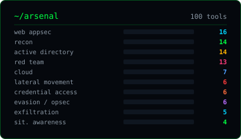

<div align="center">


<br>

[](https://www.credential.net/6f84d0b0-10db-48e1-9a00-3a47ab5e2df7#acc.qYNxeKVf)
[](https://www.credential.net/6042a909-1454-4c66-a9bc-d4f9082d3c76#acc.mqVgnslB)
[](https://www.credential.net/dc44ac07-6ace-4d25-bebc-42db4588c801#acc.16iaczMF)

[](https://www.credential.net/17903ce7-2392-46a8-8f0e-848fd4c4bd38#acc.hBix5FXy)
[](https://www.credential.net/8dc3f024-2243-4879-bed0-a78369221296#acc.h3a2yGD9)
[](https://www.credential.net/5ddddea3-af3f-4521-a47c-a9ba815e0da5#acc.j2OHCrkD)

[](https://www.credential.net/da4afe67-bbd7-4f53-9f5c-520f12a10849#acc.aO5pxtuT)
[](https://www.credential.net/fb3264d2-ded6-44fc-89f8-d57f816ebef0#acc.bFvBR3DQ)

[](https://www.credential.net/profile/omarkhalidalimohamedahmed701437/wallet)
[](https://omareldemery.com)

</div>

---

```console
$ cat /etc/profile.d/omar.sh
```

```yaml
handle:      amooryx
role:        Offensive Security Engineer · Penetration Tester
focus:       [ web appsec, active directory, cloud, memory forensics ]
certs:
  offsec:    [ OSCP+, OSCP ]
  altered:   [ CRTP ]
  ine:       [ eWPTX, eCPPT, eJPT, eCDFP, eCIR ]
verify:      every badge above links to its own verifiable credential
research:    MCP server attack surface · masqueraded process detection
building:    RedCell — a unified red-team command console for the 100 tools below
status:      100 tools shipped · building the dashboard that ties them together
disclosure:  coordinated · authorised engagements only
```

I break things on purpose, with permission, and then write the tool that finds it faster next time. Most of what is below started as something I needed mid-engagement at 2am.

---

## 🛠️ Tech Stack &amp; Skills

#### Security &amp; Research


#### Frontend


#### Backend &amp; Database


#### Architecture


#### Cloud, DevOps &amp; Testing


#### AI &amp; LLM


#### Automation &amp; AI-Assisted Development


#### Red Team &amp; Pentest Tools
[](https://portswigger.net/burp)
[](https://nmap.org)
[](https://www.metasploit.com)

Commonly used tools across authorized pentesting and bug bounty workflows:

**Web testing**

[](https://www.zaproxy.org/) · [](https://caido.io/) · [](https://github.com/ffuf/ffuf) · [](https://github.com/epi052/feroxbuster) · [](https://github.com/OJ/gobuster) · [](https://github.com/maurosoria/dirsearch) · [](https://sqlmap.org/) · [](https://github.com/hahwul/dalfox) · [](https://github.com/s0md3v/Arjun) · [](https://github.com/projectdiscovery/nuclei) · [](https://github.com/projectdiscovery/interactsh) · [](https://wpscan.com/)

**Recon &amp; discovery**

[](https://github.com/owasp-amass/amass) · [](https://github.com/projectdiscovery/subfinder) · [](https://github.com/tomnomnom/assetfinder) · [](https://github.com/projectdiscovery/httpx) · [](https://github.com/projectdiscovery/dnsx) · [](https://github.com/projectdiscovery/naabu) · [](https://github.com/projectdiscovery/katana) · [](https://github.com/lc/gau) · [](https://github.com/tomnomnom/waybackurls) · [](https://nmap.org/) · [](https://github.com/robertdavidgraham/masscan)

**Network &amp; traffic analysis**

[](https://www.wireshark.org/) · [](https://www.tcpdump.org/) · [](https://nmap.org/ncat/) · [](https://github.com/drwetter/testssl.sh) · [](https://github.com/sullo/nikto)

**Active Directory &amp; credentials**

[](https://github.com/SpecterOps/BloodHound) · [](https://github.com/ly4k/Certipy) · [](https://github.com/Pennyw0rth/NetExec) · [](https://github.com/fortra/impacket) · [](https://github.com/SpiderLabs/Responder) · [](https://github.com/ropnop/kerbrute) · [](https://github.com/GhostPack/Rubeus) · [](https://github.com/gentilkiwi/mimikatz) · [](https://hashcat.net/hashcat/) · [](https://www.openwall.com/john/) · [](https://github.com/Hackplayers/evil-winrm) · [](https://github.com/vanhauser-thc/thc-hydra)

**Cloud &amp; containers**

[](https://github.com/prowler-cloud/prowler) · [](https://github.com/nccgroup/ScoutSuite) · [](https://github.com/RhinoSecurityLabs/pacu) · [](https://github.com/aquasecurity/kube-hunter) · [](https://github.com/aquasecurity/trivy)

#### Languages
Primary languages across my public repositories:


#### Published Tools
All 100 focused security tools, plus the RedCell operations console:

<details>
<summary><b>Browse all 101 published repositories</b></summary>
<br>

**Recon &amp; OSINT**

[](https://github.com/amooryx/ReconPal) · [](https://github.com/amooryx/subdomain-storm) · [](https://github.com/amooryx/cert-recon) · [](https://github.com/amooryx/asn-mapper) · [](https://github.com/amooryx/dns-recon) · [](https://github.com/amooryx/vhost-scanner) · [](https://github.com/amooryx/git-recon) · [](https://github.com/amooryx/meta-extract) · [](https://github.com/amooryx/param-mine) · [](https://github.com/amooryx/email-harvest) · [](https://github.com/amooryx/linkedin-recon) · [](https://github.com/amooryx/stealth-scan) · [](https://github.com/amooryx/snmp-walker) · [](https://github.com/amooryx/vpn-probe)

**Web Application Security**

[](https://github.com/amooryx/jwt-attack-suite) · [](https://github.com/amooryx/oauth-auditor) · [](https://github.com/amooryx/ssrf-scanner) · [](https://github.com/amooryx/ssti-hunter) · [](https://github.com/amooryx/xxe-injector) · [](https://github.com/amooryx/smuggler) · [](https://github.com/amooryx/cache-probe) · [](https://github.com/amooryx/proto-pollute) · [](https://github.com/amooryx/graphql-attack-mapper) · [](https://github.com/amooryx/path-traversal) · [](https://github.com/amooryx/open-redirect-scanner) · [](https://github.com/amooryx/waf-bypass) · [](https://github.com/amooryx/host-injector) · [](https://github.com/amooryx/api-fuzz) · [](https://github.com/amooryx/cors-tester) · [](https://github.com/amooryx/secret-scanner)

**Active Directory**

[](https://github.com/amooryx/ad-enum) · [](https://github.com/amooryx/kerbroast) · [](https://github.com/amooryx/acl-abuser) · [](https://github.com/amooryx/ldap-dump) · [](https://github.com/amooryx/dc-checker) · [](https://github.com/amooryx/gpo-hunter) · [](https://github.com/amooryx/pass-spray) · [](https://github.com/amooryx/privesc-mapper) · [](https://github.com/amooryx/lateral-trace) · [](https://github.com/amooryx/smb-audit) · [](https://github.com/amooryx/asrep-roast) · [](https://github.com/amooryx/spn-scanner) · [](https://github.com/amooryx/delegation-hunter) · [](https://github.com/amooryx/dcsync-check) · [](https://github.com/amooryx/adcs-audit) · [](https://github.com/amooryx/shadow-cred) · [](https://github.com/amooryx/trust-mapper) · [](https://github.com/amooryx/ticket-forge)

**Credential Access**

[](https://github.com/amooryx/ntds-parse) · [](https://github.com/amooryx/hash-ident) · [](https://github.com/amooryx/dpapi-decrypt) · [](https://github.com/amooryx/cred-vault) · [](https://github.com/amooryx/browser-creds) · [](https://github.com/amooryx/keepass-audit)

**Lateral Movement**

[](https://github.com/amooryx/wmi-exec) · [](https://github.com/amooryx/winrm-exec) · [](https://github.com/amooryx/dcom-exec) · [](https://github.com/amooryx/smb-exec) · [](https://github.com/amooryx/rdp-enum) · [](https://github.com/amooryx/ssh-pivot)

**Cloud &amp; Container**

[](https://github.com/amooryx/aws-bucket-brute) · [](https://github.com/amooryx/aws-pivot) · [](https://github.com/amooryx/azure-enum) · [](https://github.com/amooryx/gcp-probe) · [](https://github.com/amooryx/k8s-audit) · [](https://github.com/amooryx/lambda-abuse) · [](https://github.com/amooryx/Cloud-Storage-Artifacts)

**Red Team &amp; Post-Exploitation**

[](https://github.com/amooryx/RedCell) · [](https://github.com/amooryx/phantom-c2) · [](https://github.com/amooryx/c2-profile-gen) · [](https://github.com/amooryx/redirector) · [](https://github.com/amooryx/dns-beacon) · [](https://github.com/amooryx/shellcode-gen) · [](https://github.com/amooryx/process-inject) · [](https://github.com/amooryx/persistence-kit) · [](https://github.com/amooryx/edr-map) · [](https://github.com/amooryx/loot-harvest) · [](https://github.com/amooryx/Rev_Shell) · [](https://github.com/amooryx/macro-gen) · [](https://github.com/amooryx/hta-builder) · [](https://github.com/amooryx/lnk-forge) · [](https://github.com/amooryx/iso-pack) · [](https://github.com/amooryx/phish-planner)

**Evasion &amp; OPSEC**

[](https://github.com/amooryx/amsi-check) · [](https://github.com/amooryx/entropy-check) · [](https://github.com/amooryx/sleep-mask) · [](https://github.com/amooryx/opsec-lint) · [](https://github.com/amooryx/script-obfuscator) · [](https://github.com/amooryx/artifact-tracker)

**Exfiltration**

[](https://github.com/amooryx/dns-exfil) · [](https://github.com/amooryx/icmp-tunnel) · [](https://github.com/amooryx/http-tunnel) · [](https://github.com/amooryx/cloud-exfil) · [](https://github.com/amooryx/stego-exfil)

**Situational Awareness**

[](https://github.com/amooryx/host-recon) · [](https://github.com/amooryx/av-enum) · [](https://github.com/amooryx/token-hunter) · [](https://github.com/amooryx/uac-audit)

**Defensive &amp; Research**

[](https://github.com/amooryx/ProcSentinel) · [](https://github.com/amooryx/MalwareFusionLightGBM) · [](https://github.com/amooryx/http-headers-auditor)

</details>

---

## `~/arsenal`

<div align="center">

</div>

> ### ◆ [RedCell](https://github.com/amooryx/RedCell) — a red-team operations console
> A native Windows app modelled on Cobalt Strike / Sliver / Havoc: build **attack chains** across
> MITRE ATT&CK tactics, manage **C2** listeners and sessions, run **phishing** campaigns, generate
> **payloads** — with the 100 tools below as the building blocks each step calls on. Engagement-scoped,
> Apple-clean, light + dark.
> **[⬇ Download the .exe](https://github.com/amooryx/RedCell/releases/latest)** · [source](https://github.com/amooryx/RedCell)

<details open>
<summary><b>Recon &amp; OSINT</b></summary>
<br>

| Tool | What it does |
|---|---|
| [**ReconPal**](https://github.com/amooryx/ReconPal) | Friendly recon + config audit, with MCP deployment discovery |
| [subdomain-storm](https://github.com/amooryx/subdomain-storm) | Subdomain enumeration at speed |
| [cert-recon](https://github.com/amooryx/cert-recon) | Certificate transparency mining |
| [asn-mapper](https://github.com/amooryx/asn-mapper) | ASN → netblock → host mapping |
| [dns-recon](https://github.com/amooryx/dns-recon) · [vhost-scanner](https://github.com/amooryx/vhost-scanner) | DNS and virtual host discovery |
| [git-recon](https://github.com/amooryx/git-recon) · [meta-extract](https://github.com/amooryx/meta-extract) | Exposed VCS and document metadata |
| [param-mine](https://github.com/amooryx/param-mine) | Hidden parameter discovery |
| [email-harvest](https://github.com/amooryx/email-harvest) · [linkedin-recon](https://github.com/amooryx/linkedin-recon) | People and surface OSINT |
| [stealth-scan](https://github.com/amooryx/stealth-scan) · [snmp-walker](https://github.com/amooryx/snmp-walker) | Low-noise port scanning and SNMP enumeration |
| [vpn-probe](https://github.com/amooryx/vpn-probe) | VPN endpoint fingerprinting |

</details>

<details>
<summary><b>Web Application Security</b></summary>
<br>

| Tool | What it does |
|---|---|
| [jwt-attack-suite](https://github.com/amooryx/jwt-attack-suite) | `alg:none`, key confusion, weak HMAC, `kid` injection |
| [oauth-auditor](https://github.com/amooryx/oauth-auditor) | OAuth / OIDC flow weaknesses |
| [ssrf-scanner](https://github.com/amooryx/ssrf-scanner) | SSRF with IMDS and out-of-band testing |
| [ssti-hunter](https://github.com/amooryx/ssti-hunter) · [xxe-injector](https://github.com/amooryx/xxe-injector) | Template and XML injection |
| [smuggler](https://github.com/amooryx/smuggler) · [cache-probe](https://github.com/amooryx/cache-probe) | Request smuggling and cache poisoning |
| [proto-pollute](https://github.com/amooryx/proto-pollute) | Prototype pollution |
| [graphql-attack-mapper](https://github.com/amooryx/graphql-attack-mapper) | GraphQL introspection and resolver abuse |
| [path-traversal](https://github.com/amooryx/path-traversal) · [open-redirect-scanner](https://github.com/amooryx/open-redirect-scanner) | Traversal and redirect chains |
| [waf-bypass](https://github.com/amooryx/waf-bypass) · [host-injector](https://github.com/amooryx/host-injector) | Filter evasion and Host header abuse |
| [api-fuzz](https://github.com/amooryx/api-fuzz) · [cors-tester](https://github.com/amooryx/cors-tester) · [secret-scanner](https://github.com/amooryx/secret-scanner) | API, CORS, and credential exposure |

</details>

<details>
<summary><b>Active Directory</b></summary>
<br>

| Tool | What it does |
|---|---|
| [ad-enum](https://github.com/amooryx/ad-enum) | Domain enumeration |
| [kerbroast](https://github.com/amooryx/kerbroast) | Kerberoasting |
| [acl-abuser](https://github.com/amooryx/acl-abuser) | ACL and delegation abuse paths |
| [ldap-dump](https://github.com/amooryx/ldap-dump) · [dc-checker](https://github.com/amooryx/dc-checker) | LDAP extraction and DC posture |
| [gpo-hunter](https://github.com/amooryx/gpo-hunter) | Group Policy misconfiguration |
| [pass-spray](https://github.com/amooryx/pass-spray) | Rate-aware password spraying |
| [privesc-mapper](https://github.com/amooryx/privesc-mapper) · [lateral-trace](https://github.com/amooryx/lateral-trace) | Escalation and movement paths |
| [smb-audit](https://github.com/amooryx/smb-audit) | SMB share and signing review |
| [asrep-roast](https://github.com/amooryx/asrep-roast) · [spn-scanner](https://github.com/amooryx/spn-scanner) | AS-REP roasting and SPN discovery |
| [delegation-hunter](https://github.com/amooryx/delegation-hunter) · [dcsync-check](https://github.com/amooryx/dcsync-check) | Delegation and replication-rights abuse |
| [adcs-audit](https://github.com/amooryx/adcs-audit) · [shadow-cred](https://github.com/amooryx/shadow-cred) | AD CS templates and Shadow Credentials |
| [trust-mapper](https://github.com/amooryx/trust-mapper) · [ticket-forge](https://github.com/amooryx/ticket-forge) | Trust enumeration and ticket analysis |

</details>

<details>
<summary><b>Credential Access</b></summary>
<br>

| Tool | What it does |
|---|---|
| [ntds-parse](https://github.com/amooryx/ntds-parse) · [hash-ident](https://github.com/amooryx/hash-ident) | NTDS hash parsing and hash-type identification |
| [dpapi-decrypt](https://github.com/amooryx/dpapi-decrypt) · [cred-vault](https://github.com/amooryx/cred-vault) | DPAPI blob and Credential Vault review |
| [browser-creds](https://github.com/amooryx/browser-creds) · [keepass-audit](https://github.com/amooryx/keepass-audit) | Browser and KeePass credential exposure |

</details>

<details>
<summary><b>Lateral Movement</b></summary>
<br>

| Tool | What it does |
|---|---|
| [wmi-exec](https://github.com/amooryx/wmi-exec) · [winrm-exec](https://github.com/amooryx/winrm-exec) | WMI and WinRM remote-execution reachability |
| [dcom-exec](https://github.com/amooryx/dcom-exec) · [smb-exec](https://github.com/amooryx/smb-exec) | DCOM and SMB execution surfaces |
| [rdp-enum](https://github.com/amooryx/rdp-enum) · [ssh-pivot](https://github.com/amooryx/ssh-pivot) | RDP enumeration and SSH pivot planning |

</details>

<details>
<summary><b>Cloud &amp; Container</b></summary>
<br>

| Tool | What it does |
|---|---|
| [aws-bucket-brute](https://github.com/amooryx/aws-bucket-brute) · [aws-pivot](https://github.com/amooryx/aws-pivot) | S3 exposure and AWS role pivoting |
| [azure-enum](https://github.com/amooryx/azure-enum) · [gcp-probe](https://github.com/amooryx/gcp-probe) | Azure and GCP enumeration |
| [k8s-audit](https://github.com/amooryx/k8s-audit) | Kubernetes RBAC and workload review |
| [lambda-abuse](https://github.com/amooryx/lambda-abuse) | Serverless privilege abuse |
| [Cloud-Storage-Artifacts](https://github.com/amooryx/Cloud-Storage-Artifacts) | Cloud storage artefact collection |

</details>

<details>
<summary><b>Red Team &amp; Post-Exploitation</b></summary>
<br>

| Tool | What it does |
|---|---|
| [phantom-c2](https://github.com/amooryx/phantom-c2) | Lightweight HTTP/S command &amp; control |
| [c2-profile-gen](https://github.com/amooryx/c2-profile-gen) · [redirector](https://github.com/amooryx/redirector) | Malleable profiles and traffic redirection |
| [dns-beacon](https://github.com/amooryx/dns-beacon) | DNS-channel beaconing |
| [shellcode-gen](https://github.com/amooryx/shellcode-gen) · [process-inject](https://github.com/amooryx/process-inject) | Payload generation and injection |
| [persistence-kit](https://github.com/amooryx/persistence-kit) · [edr-map](https://github.com/amooryx/edr-map) | Persistence and defensive-control mapping |
| [loot-harvest](https://github.com/amooryx/loot-harvest) | Credential and artefact collection |
| [Rev_Shell](https://github.com/amooryx/Rev_Shell) | Reverse shell generation and handling |
| [macro-gen](https://github.com/amooryx/macro-gen) · [hta-builder](https://github.com/amooryx/hta-builder) | Office macro and HTA initial-access templates |
| [lnk-forge](https://github.com/amooryx/lnk-forge) · [iso-pack](https://github.com/amooryx/iso-pack) | LNK and ISO/container delivery packaging |
| [phish-planner](https://github.com/amooryx/phish-planner) | Authorised phishing campaign planning |

</details>

<details>
<summary><b>Evasion &amp; OPSEC</b></summary>
<br>

| Tool | What it does |
|---|---|
| [amsi-check](https://github.com/amooryx/amsi-check) · [entropy-check](https://github.com/amooryx/entropy-check) | AMSI status and artefact-entropy checks |
| [sleep-mask](https://github.com/amooryx/sleep-mask) · [opsec-lint](https://github.com/amooryx/opsec-lint) | Beacon timing modelling and OPSEC linting |
| [script-obfuscator](https://github.com/amooryx/script-obfuscator) · [artifact-tracker](https://github.com/amooryx/artifact-tracker) | Reversible transforms and artefact clean-up |

</details>

<details>
<summary><b>Exfiltration</b></summary>
<br>

| Tool | What it does |
|---|---|
| [dns-exfil](https://github.com/amooryx/dns-exfil) · [icmp-tunnel](https://github.com/amooryx/icmp-tunnel) | DNS and ICMP covert-channel PoCs |
| [http-tunnel](https://github.com/amooryx/http-tunnel) · [cloud-exfil](https://github.com/amooryx/cloud-exfil) | HTTP tunnelling and cloud egress paths |
| [stego-exfil](https://github.com/amooryx/stego-exfil) | Image steganography for DLP testing |

</details>

<details>
<summary><b>Situational Awareness</b></summary>
<br>

| Tool | What it does |
|---|---|
| [host-recon](https://github.com/amooryx/host-recon) · [av-enum](https://github.com/amooryx/av-enum) | Host collection and AV/EDR enumeration |
| [token-hunter](https://github.com/amooryx/token-hunter) · [uac-audit](https://github.com/amooryx/uac-audit) | Access-token review and UAC auditing |

</details>

<details>
<summary><b>Defensive &amp; Research</b></summary>
<br>

| Tool | What it does |
|---|---|
| [**ProcSentinel**](https://github.com/amooryx/ProcSentinel) | Memory forensics — detecting masqueraded Windows processes via Volatility 3 |
| [MalwareFusionLightGBM](https://github.com/amooryx/MalwareFusionLightGBM) | Cross-domain malware detection |
| [http-headers-auditor](https://github.com/amooryx/http-headers-auditor) | Security header posture |

</details>

---

<div align="center">

</div>

## `~/research`

- **Detecting Masqueraded Windows Processes in Volatile Memory** — a rule-based detection framework and weighted scoring model over Volatility 3 output *(ProcSentinel)*
- **Mapping the Pre-Authentication Attack Surface of MCP Servers** — staged reconnaissance methodology for Model Context Protocol deployments

---

<div align="center">




<br><br>

```
all tooling published here is for authorised security testing only
```

**[omareldemery.com](https://omareldemery.com)**

</div>
